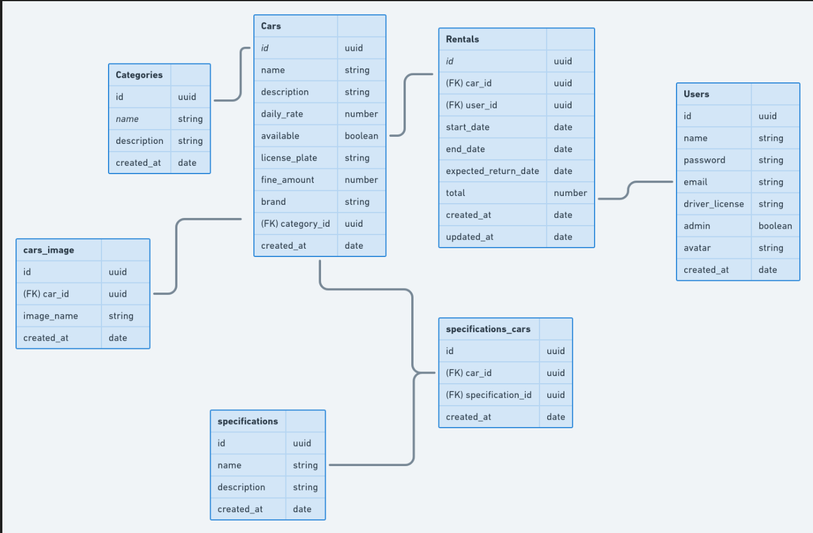

# Rentx-server

# About the project

Fictitious car rental application, using React with Tailwind CSS on the frontend, and Node.js with Express on the backend to handle API routes,
business logic and data persistence. This application was developed from scratch in Rocketseat's Ignite Node.js course

# Technologies
## Back end
- Node.js with Express
- AWS
- Bcrypt
- Class Transformer
- CORS
- Dayjs
- Docker
- DOTENV
- JSON WEB Token
- Handle Bars
- Mime
- Multer
- Node Mailer
- Postgres
- Redis
- Refresh Token
- TypeORM
- Swagger UI
- UUID

## Good practices implemented

- Separation of layers: routes, controllers, services, models.
- Middlewares for error handling and authentication

# Developed Features

## Car

- New car registration
- Car category registration
- Car rental registration
- Car return registration
- List of all cars and filter according to brand, category or vehicle name.

## User

- New user registration
- User avatar registration
- List of logged-in user information
- Login with authentication token
- Automatic generation of a Refresh Token
- Generation of a new password after email confirmation.

# Data Base Diagram :

# Author

Ítalo Costa Cavalcante

https://www.linkedin.com/in/italo-costa-cavalcante/
